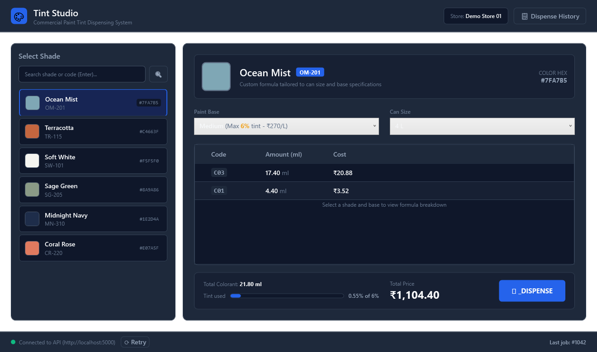
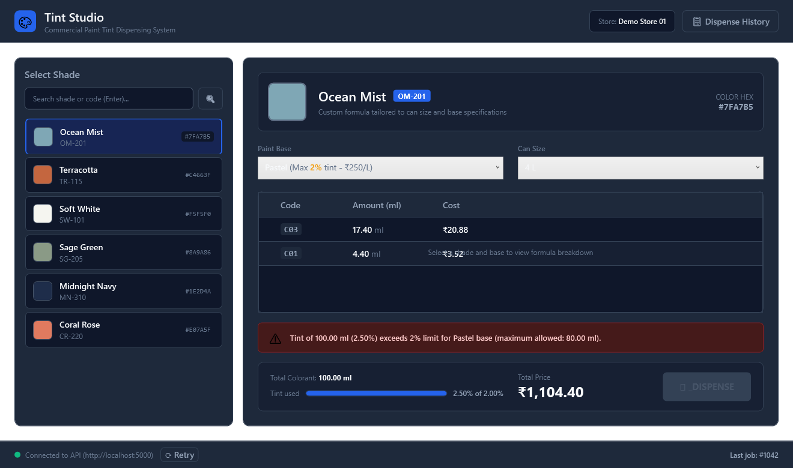
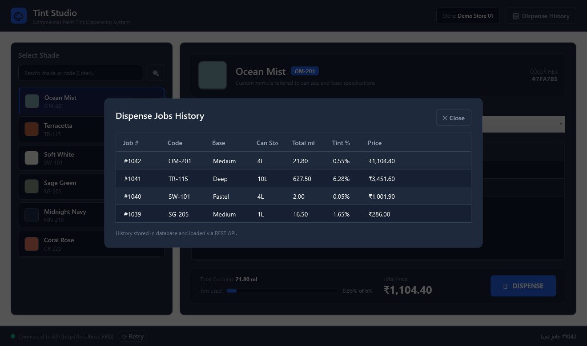

# Paint Tint Formula Calculator

[](https://dotnet.microsoft.com/download/dotnet/8.0)
[](file:///d:/Repo/Paint-Tint-Formula-Calculator/tests/PaintTint.Tests)

An end-to-end commercial paint tinting calculation and dispensing application built with **.NET 8**, **WPF (MVVM)**, **ASP.NET Core Web API**, and **Entity Framework Core with SQLite**.

---

## 📸 Application Screenshots

### 1. Main Calculation & Dispensing Station
Interactive formula scaling, color swatches, real-time tint limit progress tracking, and total pricing calculation.


### 2. Validation & Maximum Tint % Limit Guard
Inline error notification when colorant volume exceeds base limit (e.g., Pastel 2% limit). The Dispense action is safely disabled.


### 3. Dispense History Drawer
Past dispense jobs stored in the database and loaded asynchronously via REST API.


---

## 🎯 Features & Business Rules Implementation

1. **Linear Scaling**: Colorant amounts scale linearly with can size: **1 L, 4 L, 10 L, and 20 L**.
2. **Dispenser Rounding (0.05 ml unit)**: Every colorant amount is scaled and rounded to the nearest `0.05 ml` using `Math.Round(amount * 20m, MidpointRounding.AwayFromZero) / 20m`.
3. **Base Maximum Tint % Guard**:
   - **Pastel**: Maximum 2% tint
   - **Medium**: Maximum 6% tint
   - **Deep**: Maximum 12% tint
   - If total colorant (ml) exceeds the allowable percentage of can volume (e.g. `CanSizeLitres * 1000 ml`), the request is rejected with a clear, user-friendly message (`"Tint of X ml (Y%) exceeds Z% limit for BaseName base"`).
4. **Accurate Pricing Calculation**:
   - $\text{Price} = (\text{Base Price/Litre} \times \text{Litres}) + \sum (\text{Colorant ml} \times \text{Colorant Cost/ml})$
   - Currency formatted with thousand separators and Indian Rupee symbol ($\text{₹}$).
5. **Historical Dispense Tracking**: Each dispense job and individual dispensed items are recorded in the database, preserving past records even if formula definitions or prices change.

---

## 🏗️ Architecture & Project Structure

The solution follows Clean Architecture principles:

```text
PaintTint-Formula-Calculator/
├── src/
│   ├── PaintTint.Core/             # Domain entities, DTOs, domain exceptions & TintCalculator
│   │   ├── Entities/               # Base, Colorant, Shade, FormulaItem, DispenseJob, DispenseJobItem
│   │   ├── DTOs/                   # Calculation and transfer objects
│   │   ├── Exceptions/             # TintValidationException, NotFoundException
│   │   └── Services/               # ITintCalculator & pure calculation logic
│   ├── PaintTint.Infrastructure/   # EF Core DbContext, SQLite migrations, JSON Seeder & Repositories
│   │   ├── Data/                   # PaintTintDbContext, DatabaseSeeder, seed.json
│   │   ├── Migrations/             # EF Core schema migration
│   │   └── Services/               # ShadeService, BaseService, DispenseService
│   ├── PaintTint.Api/              # ASP.NET Core Web API & Swagger UI
│   │   ├── Controllers/            # ShadesController, BasesController, TintController, DispenseJobsController
│   │   ├── Middleware/             # ExceptionHandlingMiddleware
│   │   └── Dockerfile              # Docker containerization
│   └── PaintTint.Wpf/              # WPF desktop application (MVVM)
│       ├── ViewModels/             # MainViewModel, ObservableObject (CommunityToolkit.Mvvm)
│       ├── Services/               # TintApiClient with async HttpClient
│       ├── Converters/             # HexToBrushConverter, SafeBooleanToVisibilityConverter
│       └── Styles/                 # Theme.xaml (ResourceDictionary design system)
├── tests/
│   └── PaintTint.Tests/            # xUnit tests covering scaling, rounding, limits & pricing
├── data/
│   └── seed.json                   # Appendix seed dataset + realistic test shades
├── docs/screenshots/               # App preview screenshots
└── docker-compose.yml              # Multi-container orchestrator for API
```

---

## 🗄️ Database Design

### Schema Overview

- **`Bases`**: `Id` (PK), `Name` (Unique, max 50), `MaxTintPercent` (decimal 5,2), `PricePerLitre` (decimal 10,2).
- **`Colorants`**: `Id` (PK), `Code` (Unique, max 10), `Name` (max 50), `CostPerMl` (decimal 10,4).
- **`Shades`**: `Id` (PK), `Code` (Unique, max 20), `Name` (Indexed for search, max 100), `HexColor` (char 7).
- **`FormulaItems`**: `Id` (PK), `ShadeId` (FK), `BaseId` (FK), `ColorantId` (FK), `MlPerLitre` (decimal 10,4).
  - *Unique Index*: `(ShadeId, BaseId, ColorantId)` ensures no duplicate colorant definitions per base.
- **`DispenseJobs`**: `Id` (PK), `ShadeId` (FK), `BaseId` (FK), `CanSizeLitres` (decimal 5,2), `TotalColorantMl` (decimal 10,2), `TintPercent` (decimal 5,2), `TotalPrice` (decimal 12,2), `CreatedAtUtc` (datetime2).
- **`DispenseJobItems`**: `Id` (PK), `DispenseJobId` (FK, cascade delete), `ColorantId` (FK), `DispensedMl` (decimal 10,2), `Cost` (decimal 10,2).

> **Design note**: All financial and quantity columns use `decimal`, never floating-point types, guaranteeing exact arithmetic.

---

## 🚀 Getting Started

### Prerequisites
- [.NET 8.0 SDK](https://dotnet.microsoft.com/download/dotnet/8.0) or later.
- Windows OS (for running the WPF client).

### 1. Build the Solution
```bash
dotnet build PaintTint.sln
```

### 2. Run the Unit Tests
All 20 unit tests validate rounding, linear scaling across 1L/4L/10L/20L cans, tint limit exceptions, and pricing:
```bash
dotnet test
```

### 3. Run the Web API
In a terminal, start the ASP.NET Core API server:
```bash
dotnet run --project src/PaintTint.Api/PaintTint.Api.csproj --launch-profile http
```
The API starts on `http://localhost:5000`.
- **Interactive Swagger Documentation**: Open `http://localhost:5000/swagger` in your browser.
- Database (`painttint.db`) is automatically migrated and seeded with initial bases, colorants, and shades from `seed.json` on startup.

### 4. Run the WPF Desktop Client
In a separate terminal or Visual Studio:
```bash
dotnet run --project src/PaintTint.Wpf/PaintTint.Wpf.csproj
```

Alternatively, run the compiled binary:
```bash
src\PaintTint.Wpf\bin\Debug\net8.0-windows\PaintTint.Wpf.exe
```

---

## 🐳 Optional Docker Setup (Bonus Feature)

To run the Web API and SQLite database inside a Docker container:
```bash
docker compose up --build
```
The API and Swagger will be available at `http://localhost:5000/swagger`.

---

## 🧪 Unit Tests Summary

The test suite in [`PaintTint.Tests`](file:///d:/Repo/Paint-Tint-Formula-Calculator/tests/PaintTint.Tests/TintCalculatorTests.cs) covers:
1. **Dispenser Unit Rounding**: Verifies 0.05 ml boundary conditions (e.g. `0.02` -> `0.00`, `0.03` -> `0.05`, `0.075` -> `0.10`, `4.35`, `12.80`).
2. **Linear Scaling**: Verifies exact scaling across 1L, 4L, 10L, and 20L cans.
3. **Specification Worked Example**: 3.2 ml/L Black in Medium base for 4L can = 12.8 ml (0.32% tint vs 6% max, price ₹1,090.24).
4. **Mockup Example**: Ocean Mist with Phthalo Blue and Black in 4L Medium base matching ₹1,104.40 total.
5. **Tint Limit Enforcement**: Validation failure when tint % exceeds base thresholds (e.g. 2.50% > 2.00% Pastel limit).
6. **Can Size Validation**: Rejecting invalid sizes (e.g. 5L, 7L).
7. **Bulk Volume & Pricing**: Testing 20L high-volume container calculations.

---

## 💡 Assumptions & Design Decisions

1. **Database Selection**: SQLite was chosen as the default relational provider because it runs zero-configuration cross-platform, stores schema in a single file (`painttint.db`), and supports full ACID transactions and foreign keys.
2. **Currency**: As shown in the assignment layout specification, prices are displayed using the Indian Rupee symbol ($\text{₹}$) with standard 2-decimal formatting and thousand separators.
3. **API Resilience**: The WPF desktop client performs non-blocking asynchronous calls (`async`/`await`), features a status bar with live API connection indicators, and gracefully recovers if the API restarts.
4. **Theme Consistency**: All colors, fonts, margins, and control templates are centralized in [`Styles/Theme.xaml`](file:///d:/Repo/Paint-Tint-Formula-Calculator/src/PaintTint.Wpf/Styles/Theme.xaml) without hardcoded inline values.
